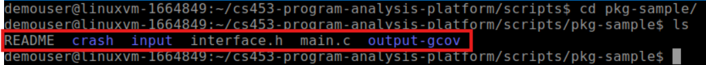
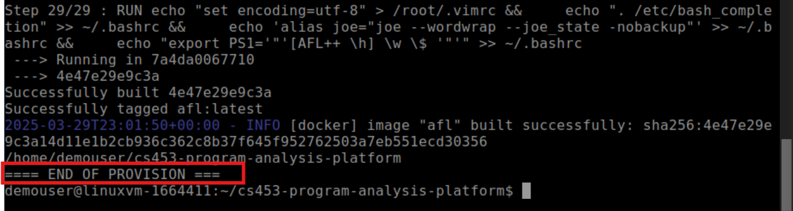
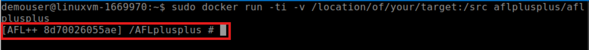
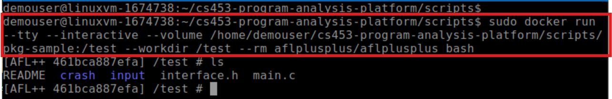
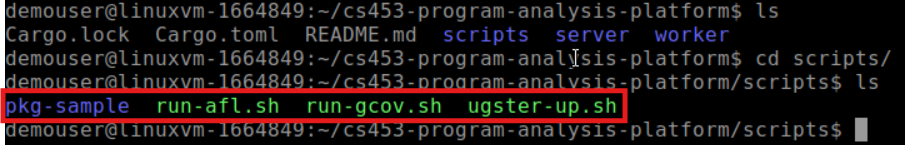
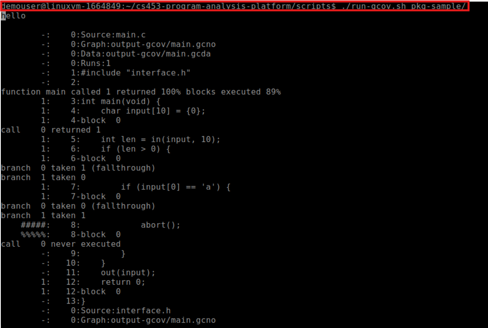

# Lab 6: Fuzzing lab
# Bugs That Are Hard to Catch


## Overview

Program analysis is used both by attackers and defenders to hunt for potential issues in the software.
However, there are always code patterns that pose unique challenges for these tools to analyze. The
goal of this lab is to help you understand the limitations of state-of-the-art program
analysis tools and get a feeling for their advantages and disadvantages with some hands-on experience.
Your goal is to craft programs **with a single bug intentionally embedded** and check
whether different program analysis tools can find the bug (evident by a program crash). If the program
analysis tool fails to find the bug *within a computation bound*, you have found a potential limitation
in this program analysis tool and will be awarded full marks for that component.

In this lab, the computation bound is **15 minutes per analyzer × 2 analyzers**:

   - AFL++: as a representative fuzzer

To confine the scope of the analysis and standardize the auto-grading process, we will NOT accept
arbitrary programs for this lab. Instead, you are encouraged to produce minimal programs
and prepare a package for each program. The package should contain not only the program code but
also information that bootstraps analysis and shows evidence that a bug indeed exists.

Specifically, each package MUST be prepared according to the requirements and restrictions below.
Failing to do so will result in an invalid package that can’t be used to score this assignment component.

  * **Directory Structure.** Each submitted package MUST follow the directory structure below:
    ```
    <package>/
        |-- main.c       // mandatory: the only code file to submit
        |-- input/       // mandatory: the test suite with 100% gcov coverage
        |   |-- <*>      // test case name can be arbitrary valid filename
        |-- crash/       // mandatory: sample inputs that crash the program
        |   |-- <*>      // sample name can be arbitrary valid filename
        |-- README.md    // optional: an explanatory note on the code and embedded bug
    ```
  * Include all source code of the program in one and only one `main.c` file. This `main.c` is the only code file you need to include in the package. DO NOT include `interface.h`.
    - Only valid C programs are allowed. DO NOT code in C++.
    - The size of `main.c` should NOT exceed 256KB (i.e., 256 × 2^10 bytes).
   
  * Your program can only invoke three library calls, all provided in `interface.h` available below.
    - `ssize_t in(void *buffer, size_t count)` which reads in at max `count` bytes from `stdin` and stores them in `buffer`. The return value indicates the actual number of bytes read in or a negative number indicating failure.
    - `int out(const char *buffer)` which prints the buffer string to `stdout`. The return value indicates the actual number of
bytes written out.
    - `void abort(void)` which forces a crash of program. Note that this is NOT the only way to crash a program.

The following figure is an example how the directory structure should be:

 
 
 ```
//interface.h

#include <stddef.h>
#include <sys/types.h>

/* external interfaces */
ssize_t read(int fd, void *buffer, size_t count);
int puts(const char *buffer);

/* exposed interfaces */
inline __attribute__((always_inline))
ssize_t in(void *buffer, size_t count) {
    return read(0, buffer, count);
}

inline __attribute__((always_inline))
int out(const char *buffer) {
    return puts(buffer);
}

void abort(void);
```

 * Your program can only take input from `stdin` using the provided `in()` function in `interface.h`. It should NOT take input from command line arguments nor environment variables. The size of input acquired from `stdin` should NOT exceed 1024 bytes.
 * Your program MUST be *compatible* with all program analysis tools used in this lab
without special modification to these tools. In other words, your program can be analyzed using
the tool invocation command provided in the later part of the lab.
 * Your program should have **one and only one bug** that is intentionally planted. If any of the tools finds a crash in your program, even if the crash is not caused by the intended bug, the tool is considered successful and this package cannot be used to claim victory over that tool.
 * Provide a set of test cases that achieves 100% coverage (see details on `gcov` below).
    - Each test case should NOT crash the program, i.e., exiting with a non-zero status code.
    - Each test case should complete its execution in 10 seconds.
    - Each test case should NOT exceed 1024 bytes in size.
 * Provide **at least one** sample input that can cause the program to crash by triggering the planted bug — this is to provide evidence on the existence of the bug.
 * Avoid using features that are known limitations for most program analysis tools, including:
    - DO NOT use any other library functions (including libc functions). The only permitted
library routines are given in the header file `interface.h`.
    - DO NOT use floating-point operations in your program.
    - DO NOT use inline assemblies in your program.
    - DO NOT use multi-threading. The entire program logic must be able to execute end-to-end
in a single process and a single thread.

Each package will be analyzed by all program analysis tools. For any tool X, if the tool finds a bug (even not the planted one), it is considered a success. Otherwise, the bug has managed to “evade” the detection from tool X and the package will be counted towards the scoring of tool X evasion.

**A maximum of 10 packages** can be submitted. You will have full points for tool X evasion as long as you have one package that “evaded” the detection from tool X. If you are confident that one package can be used to score all components, feel free to submit one package only. However, to be on the safe side, it is highly advised to submit multiple packages with
different strategies to confuse these program analysis tools.

## 1. Lab Environment Preparation

For this lab, you will use a local VM running Ubuntu 22.04.5 LTS. Once your Ubuntu VM is ready, you can provision it with the following command:

#### Common provision step for both options

```
git clone https://github.com/meng-xu-cs/cs453-program-analysis-platform.git
cd cs453-program-analysis-platform
git submodule update --init
./scripts/ugster-up.sh
```

   - NOTE: DO NOT use --recurse-submodules to clone the submodules as it will bring in many unnecessary dependencies of AFL++ and slow down the building process significantly.
   - The `./ugster-up.sh` script will take quite some time to finish (about an hour or even two hours) so you might find utilities such as `tmux` or `screen` useful in case of unreliable SSH connections.
   - During the process, you might be prompted to upgrade or restart system services. Simply hit “Enter” to go with the default choices suggested by `apt`.
   - After provision, the entire VM will take about 30GB – 35GB storage on disk.

Upon successful completion, you will see an ==== END OF PROVISION === mark in the terminal as in the following figure:

   

## 2. Coverage tracking with `gcov`
[`gcov`](https://gcc.gnu.org/onlinedocs/gcc/Gcov.html) is a tool you can use in conjunction with `gcc` to test code coverage in your programs. In a nutshell, it tracks the portion of code that is “covered” by a concrete execution at runtime and aggregates the coverage results from multiple runs to produce a final coverage report.

You can use the following `run-gcov.sh` script to check the coverage of your package. 
```
#!/bin/bash -e

# sanity check
if [ "$#" -ne 1 ]; then
    echo "Usage: $0 <path-to-package-directory>"
    exit 1
fi

# configuration
PKG=$(readlink -f $1)
WKS=output-gcov

# entrypoint
cd ${PKG}
rm -rf ${WKS} && mkdir ${WKS}
gcc -fprofile-arcs -ftest-coverage -g main.c -o ${WKS}/main
for test in input/*; do
    ${WKS}/main < ${test}
done
gcov -o ${WKS} -n main.c
```

In general, the script performs the following steps:

```
// Step 1: compile your code with gcov instrumentations
$ gcc -fprofile-arcs -ftest-coverage -g main.c -o main
// Step 2: execute each of your input test case
$ for test in input/*; do main < ${test}; done
// Step 3: collect and print coverage
$ gcov -o ./ -n main.c
```
If you read a 100% coverage in your console, it means your test suite (provided under the input/ directory) has achieved complete coverage in gcov’s perspective.

## 3. Fuzzing with AFL++

We use the open-source [AFL++ fuzzer](https://github.com/AFLplusplus/AFLplusplus), in particular, version stable (commit hash 78b7e14) which is the most up-to-date stable release of AFL++ as the lab is developed. You may want to read a bit of details on the [project page](https://aflplus.plus/) about AFL++ and fuzzing in general.

You need to install docker using the following command:
```bash
sudo apt update
```
```bash
sudo apt install docker.io
```

Then enable and start the Docker service:

```bash
sudo systemctl enable docker
```
```bash
sudo systemctl start docker
```

To verify if Docker is working, use the following command:

```bash
docker --version
```

Then, to have AFL++ easily available with everything compiled, pull the image directly from the Docker Hub using the following two commands:
```bash
sudo docker pull aflplusplus/aflplusplus
```
```bash
sudo docker run -ti -v /location/of/your/target:/src aflplusplus/aflplusplus
```

   

AFL++ is provisioned into the VM as a Docker image tagged as afl. Once in the VM, you can use
the following command to run the Docker image, get an interactive shell, and explore around.

```bash
docker run --tty --interactive --volume <path-to-your-package>:/test --workdir /test --rm aflplusplus/aflplusplus bash
```
   #### * Make sure you replace <path-to-your-package> with the path to your test package directory (e.g., /home/student/lab6/pkg1).

   
   
You can use the following `run-afl.sh` script to fuzz your package:

```
#!/bin/bash -e

# sanity check
if [ "$#" -ne 1 ]; then
    echo "Usage: $0 <path-to-package-directory>"
    exit 1
fi

# configuration
PKG=$(readlink -f $1)
WKS=output-afl
CMD=$(cat <<END
    rm -rf ${WKS} && mkdir ${WKS} &&
    afl-cc main.c -o ${WKS}/main &&
    afl-fuzz -i input -o ${WKS}/output -- ${WKS}/main
END
)

# entrypoint
docker run \
    --tty --interactive \
    --volume ${PKG}:/test \
    --workdir /test \
    --rm afl \
    bash -c "${CMD}"
```

In general, the script runs-off the `afl` Docker image and performs the following steps:

```
// Step 1: compile your code with afl instrumentations
$ afl-cc main.c -o main
// Step 2: start fuzzing your code
$ afl-fuzz -i input -o output -- main
```

The output of the AFL++ fuzzing results are stored in the output directory.

## 4. Examples

The provided repository contains a sample package under directory `scripts/pkg-sample` to illustrate how a package should look like, with the addition of `interface.h` and `.gitignore` which shouldn’t be submitted. 

 

The code can also be found on [GitHub](https://github.com/meng-xu-cs/cs453-program-analysis-platform/tree/main/scripts/pkg-sample) as well.

You can test out the sample package inside the VM via:

```
cd scripts
./run-gcov.sh pkg-sample
./run-afl.sh pkg-sample
```

The output should obviously show that:
   1) This package does not provide 100% code coverage
   2) It has a bug that is found by all tools.

Here is a sample of running `$ ./run-gcov.sh pkg-sample`:
 
      
Despite that this package sample cannot “evade” any program analysis tool, feel free to duplicate this template package to bootstrap your package preparation that can eventually “evade” the tools.

## Submission

A Dropbox has been created on LEARN for lab submission.
To complete this lab, please submit one or more test packages, each in its own folder, containing a single `main.c` file, an `input/` folder with test cases that achieve 100% code coverage, a `crash/` folder with at least one input that triggers the intended bug, and an optional `README.md` to explain your code and the bug. Only `main.c` is allowed—no additional code files or libraries—and your program must use only the provided `in()`, `out()`, and `abort()` functions for I/O and crashing. Do not include `interface.h`, compiled binaries, or unrelated files. Submit your packages as a `.zip` or `.tar.gz` archive via the Dropbox on LEARN.
You can also submit any scripts, screenshots, or documents
that you may deem necessary to show your understanding of the task.
